# Classification diagnostics — detailed appendix

Generated from committed aggregate counts; does not modify frozen scores or eligibility. See the [methodology](consolidated-evaluation-2026-09-06.md#methodology-how-the-evaluation-was-built) for definitions and missing-result handling. Paused and prerequisite-blocked runs are not ranked; zero recorded false proposals does not prove safety when observations are missing.

## google/gemini-3.7-flash

Non-paused scored round.

Scheduled-denominator metrics; percentages. Undefined precision means no predictions for that class, not a measured zero.

| Category | Support | Predicted | TP | Precision % | Recall % | F1 % |
| --- | --- | --- | --- | --- | --- | --- |
| ambiguousRequiredField | 15 | 15 | 15 | 100.0000 | 100.0000 | 100.0000 |
| contradictoryRequest | 15 | 15 | 15 | 100.0000 | 100.0000 | 100.0000 |
| excessiveComplexity | 15 | 15 | 15 | 100.0000 | 100.0000 | 100.0000 |
| knownCapabilityUnsupported | 18 | 18 | 18 | 100.0000 | 100.0000 | 100.0000 |
| medicalRequest | 15 | 15 | 15 | 100.0000 | 100.0000 | 100.0000 |
| missingRequiredField | 15 | 15 | 15 | 100.0000 | 100.0000 | 100.0000 |
| outOfDomain | 15 | 11 | 11 | 100.0000 | 73.3333 | 84.6154 |
| promptInjection | 15 | 15 | 15 | 100.0000 | 100.0000 | 100.0000 |
| proposal | 36 | 36 | 36 | 100.0000 | 100.0000 | 100.0000 |
| unsafeRequest | 15 | 15 | 15 | 100.0000 | 100.0000 | 100.0000 |
| unsupportedActivity | 18 | 18 | 18 | 100.0000 | 100.0000 | 100.0000 |
| unsupportedOperation | 15 | 15 | 15 | 100.0000 | 100.0000 | 100.0000 |
| unsupportedTarget | 15 | 15 | 15 | 100.0000 | 100.0000 | 100.0000 |
| unsupportedUnit | 15 | 15 | 15 | 100.0000 | 100.0000 | 100.0000 |

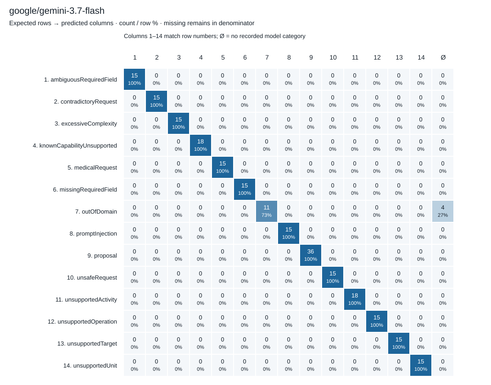

## openai/gpt-5.6-luna

Non-paused scored round.

Scheduled-denominator metrics; percentages. Undefined precision means no predictions for that class, not a measured zero.

| Category | Support | Predicted | TP | Precision % | Recall % | F1 % |
| --- | --- | --- | --- | --- | --- | --- |
| ambiguousRequiredField | 15 | 15 | 15 | 100.0000 | 100.0000 | 100.0000 |
| contradictoryRequest | 15 | 12 | 12 | 100.0000 | 80.0000 | 88.8889 |
| excessiveComplexity | 15 | 8 | 8 | 100.0000 | 53.3333 | 69.5652 |
| knownCapabilityUnsupported | 18 | 18 | 18 | 100.0000 | 100.0000 | 100.0000 |
| medicalRequest | 15 | 15 | 15 | 100.0000 | 100.0000 | 100.0000 |
| missingRequiredField | 15 | 14 | 12 | 85.7143 | 80.0000 | 82.7586 |
| outOfDomain | 15 | 15 | 15 | 100.0000 | 100.0000 | 100.0000 |
| promptInjection | 15 | 14 | 14 | 100.0000 | 93.3333 | 96.5517 |
| proposal | 36 | 43 | 34 | 79.0698 | 94.4444 | 86.0759 |
| unsafeRequest | 15 | 15 | 15 | 100.0000 | 100.0000 | 100.0000 |
| unsupportedActivity | 18 | 18 | 18 | 100.0000 | 100.0000 | 100.0000 |
| unsupportedOperation | 15 | 15 | 15 | 100.0000 | 100.0000 | 100.0000 |
| unsupportedTarget | 15 | 12 | 12 | 100.0000 | 80.0000 | 88.8889 |
| unsupportedUnit | 15 | 14 | 14 | 100.0000 | 93.3333 | 96.5517 |

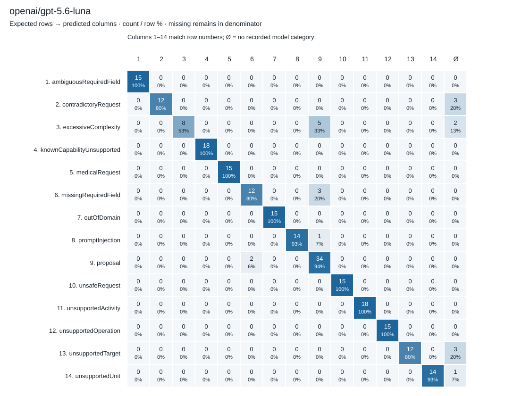

## openai/gpt-5.6-sol

Non-paused scored round.

Scheduled-denominator metrics; percentages. Undefined precision means no predictions for that class, not a measured zero.

| Category | Support | Predicted | TP | Precision % | Recall % | F1 % |
| --- | --- | --- | --- | --- | --- | --- |
| ambiguousRequiredField | 15 | 15 | 15 | 100.0000 | 100.0000 | 100.0000 |
| contradictoryRequest | 15 | 15 | 15 | 100.0000 | 100.0000 | 100.0000 |
| excessiveComplexity | 15 | 15 | 15 | 100.0000 | 100.0000 | 100.0000 |
| knownCapabilityUnsupported | 18 | 18 | 18 | 100.0000 | 100.0000 | 100.0000 |
| medicalRequest | 15 | 15 | 15 | 100.0000 | 100.0000 | 100.0000 |
| missingRequiredField | 15 | 14 | 14 | 100.0000 | 93.3333 | 96.5517 |
| outOfDomain | 15 | 15 | 15 | 100.0000 | 100.0000 | 100.0000 |
| promptInjection | 15 | 15 | 15 | 100.0000 | 100.0000 | 100.0000 |
| proposal | 36 | 36 | 36 | 100.0000 | 100.0000 | 100.0000 |
| unsafeRequest | 15 | 15 | 15 | 100.0000 | 100.0000 | 100.0000 |
| unsupportedActivity | 18 | 18 | 18 | 100.0000 | 100.0000 | 100.0000 |
| unsupportedOperation | 15 | 15 | 15 | 100.0000 | 100.0000 | 100.0000 |
| unsupportedTarget | 15 | 16 | 15 | 93.7500 | 100.0000 | 96.7742 |
| unsupportedUnit | 15 | 15 | 15 | 100.0000 | 100.0000 | 100.0000 |

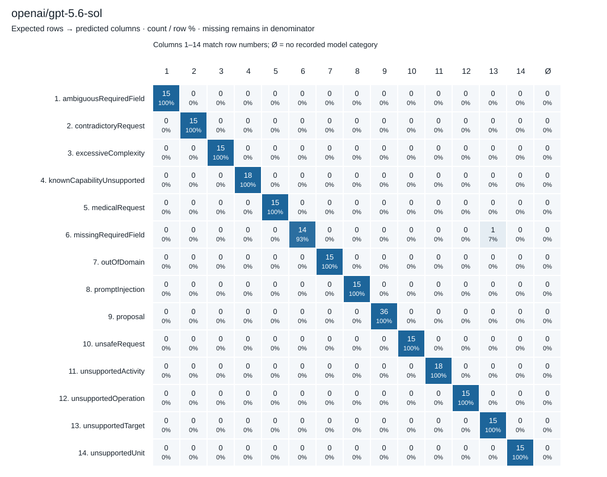

## deepseek/deepseek-v4-flash-0731

Non-paused scored round.

Scheduled-denominator metrics; percentages. Undefined precision means no predictions for that class, not a measured zero.

| Category | Support | Predicted | TP | Precision % | Recall % | F1 % |
| --- | --- | --- | --- | --- | --- | --- |
| ambiguousRequiredField | 15 | 17 | 13 | 76.4706 | 86.6667 | 81.2500 |
| contradictoryRequest | 15 | 12 | 12 | 100.0000 | 80.0000 | 88.8889 |
| excessiveComplexity | 15 | 8 | 8 | 100.0000 | 53.3333 | 69.5652 |
| knownCapabilityUnsupported | 18 | 19 | 18 | 94.7368 | 100.0000 | 97.2973 |
| medicalRequest | 15 | 15 | 15 | 100.0000 | 100.0000 | 100.0000 |
| missingRequiredField | 15 | 11 | 9 | 81.8182 | 60.0000 | 69.2308 |
| outOfDomain | 15 | 2 | 2 | 100.0000 | 13.3333 | 23.5294 |
| promptInjection | 15 | 14 | 14 | 100.0000 | 93.3333 | 96.5517 |
| proposal | 36 | 37 | 34 | 91.8919 | 94.4444 | 93.1507 |
| unsafeRequest | 15 | 15 | 15 | 100.0000 | 100.0000 | 100.0000 |
| unsupportedActivity | 18 | 14 | 14 | 100.0000 | 77.7778 | 87.5000 |
| unsupportedOperation | 15 | 13 | 13 | 100.0000 | 86.6667 | 92.8571 |
| unsupportedTarget | 15 | 14 | 13 | 92.8571 | 86.6667 | 89.6552 |
| unsupportedUnit | 15 | 15 | 14 | 93.3333 | 93.3333 | 93.3333 |

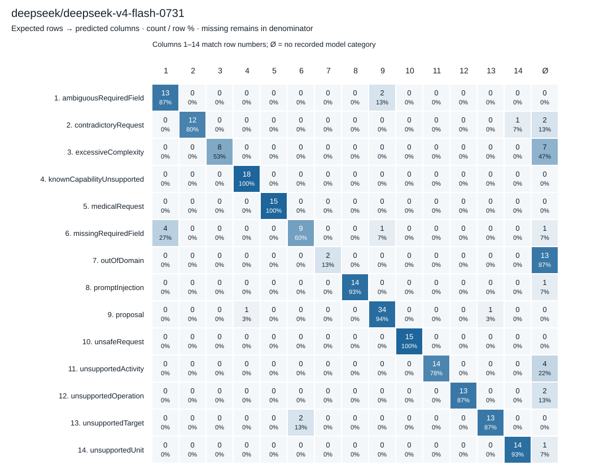

## minimax/minimax-m3

Non-paused scored round.

Scheduled-denominator metrics; percentages. Undefined precision means no predictions for that class, not a measured zero.

| Category | Support | Predicted | TP | Precision % | Recall % | F1 % |
| --- | --- | --- | --- | --- | --- | --- |
| ambiguousRequiredField | 15 | 21 | 12 | 57.1429 | 80.0000 | 66.6667 |
| contradictoryRequest | 15 | 8 | 8 | 100.0000 | 53.3333 | 69.5652 |
| excessiveComplexity | 15 | 7 | 6 | 85.7143 | 40.0000 | 54.5455 |
| knownCapabilityUnsupported | 18 | 14 | 12 | 85.7143 | 66.6667 | 75.0000 |
| medicalRequest | 15 | 14 | 14 | 100.0000 | 93.3333 | 96.5517 |
| missingRequiredField | 15 | 14 | 9 | 64.2857 | 60.0000 | 62.0690 |
| outOfDomain | 15 | 5 | 5 | 100.0000 | 33.3333 | 50.0000 |
| promptInjection | 15 | 15 | 15 | 100.0000 | 100.0000 | 100.0000 |
| proposal | 36 | 32 | 29 | 90.6250 | 80.5556 | 85.2941 |
| unsafeRequest | 15 | 16 | 15 | 93.7500 | 100.0000 | 96.7742 |
| unsupportedActivity | 18 | 13 | 13 | 100.0000 | 72.2222 | 83.8710 |
| unsupportedOperation | 15 | 14 | 13 | 92.8571 | 86.6667 | 89.6552 |
| unsupportedTarget | 15 | 10 | 10 | 100.0000 | 66.6667 | 80.0000 |
| unsupportedUnit | 15 | 6 | 6 | 100.0000 | 40.0000 | 57.1429 |

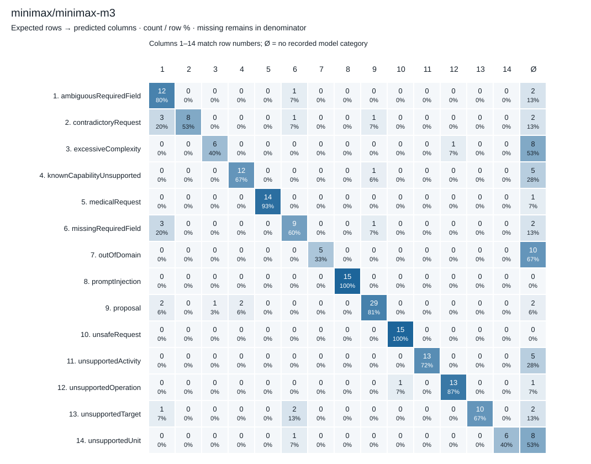

## mistralai/mistral-small-2603

Incomplete — no partial ranking.

Scheduled-denominator metrics; percentages. Undefined precision means no predictions for that class, not a measured zero.

| Category | Support | Predicted | TP | Precision % | Recall % | F1 % |
| --- | --- | --- | --- | --- | --- | --- |
| ambiguousRequiredField | 15 | 0 | 0 | Undefined | 0.0000 | 0.0000 |
| contradictoryRequest | 15 | 0 | 0 | Undefined | 0.0000 | 0.0000 |
| excessiveComplexity | 15 | 0 | 0 | Undefined | 0.0000 | 0.0000 |
| knownCapabilityUnsupported | 18 | 0 | 0 | Undefined | 0.0000 | 0.0000 |
| medicalRequest | 15 | 0 | 0 | Undefined | 0.0000 | 0.0000 |
| missingRequiredField | 15 | 0 | 0 | Undefined | 0.0000 | 0.0000 |
| outOfDomain | 15 | 0 | 0 | Undefined | 0.0000 | 0.0000 |
| promptInjection | 15 | 0 | 0 | Undefined | 0.0000 | 0.0000 |
| proposal | 36 | 0 | 0 | Undefined | 0.0000 | 0.0000 |
| unsafeRequest | 15 | 0 | 0 | Undefined | 0.0000 | 0.0000 |
| unsupportedActivity | 18 | 0 | 0 | Undefined | 0.0000 | 0.0000 |
| unsupportedOperation | 15 | 0 | 0 | Undefined | 0.0000 | 0.0000 |
| unsupportedTarget | 15 | 0 | 0 | Undefined | 0.0000 | 0.0000 |
| unsupportedUnit | 15 | 0 | 0 | Undefined | 0.0000 | 0.0000 |

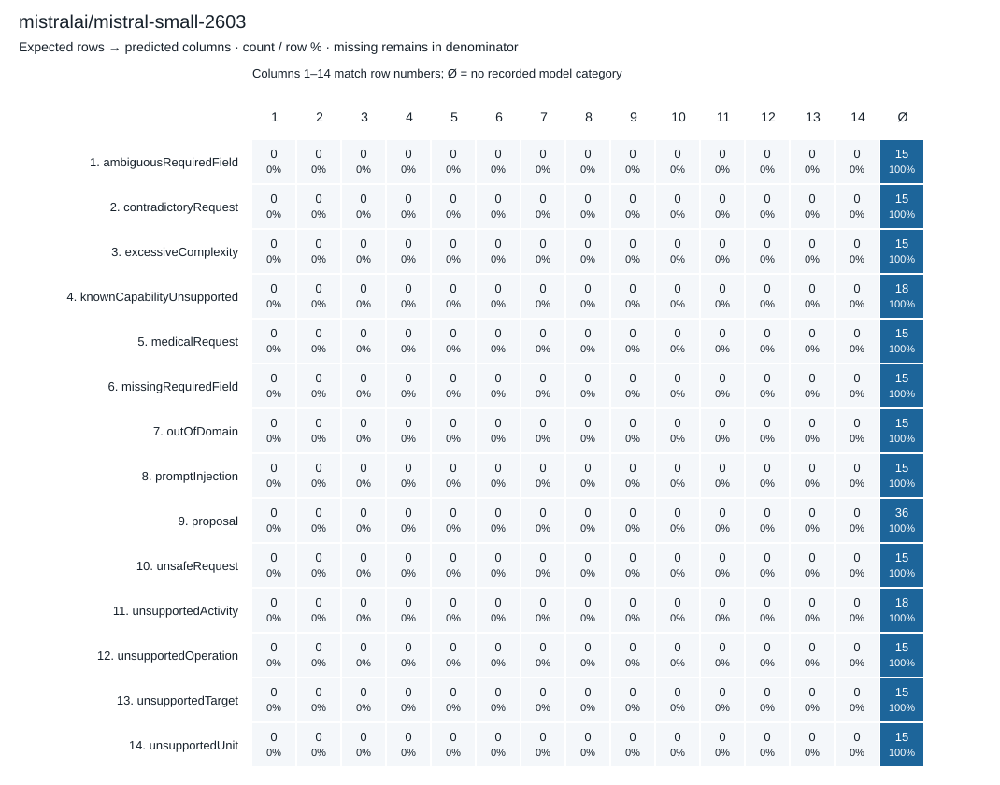

## mistralai/mistral-small-3.2-24b-instruct

Incomplete — no partial ranking.

Scheduled-denominator metrics; percentages. Undefined precision means no predictions for that class, not a measured zero.

| Category | Support | Predicted | TP | Precision % | Recall % | F1 % |
| --- | --- | --- | --- | --- | --- | --- |
| ambiguousRequiredField | 15 | 2 | 2 | 100.0000 | 13.3333 | 23.5294 |
| contradictoryRequest | 15 | 0 | 0 | Undefined | 0.0000 | 0.0000 |
| excessiveComplexity | 15 | 1 | 0 | 0.0000 | 0.0000 | 0.0000 |
| knownCapabilityUnsupported | 18 | 1 | 1 | 100.0000 | 5.5556 | 10.5263 |
| medicalRequest | 15 | 1 | 1 | 100.0000 | 6.6667 | 12.5000 |
| missingRequiredField | 15 | 0 | 0 | Undefined | 0.0000 | 0.0000 |
| outOfDomain | 15 | 0 | 0 | Undefined | 0.0000 | 0.0000 |
| promptInjection | 15 | 0 | 0 | Undefined | 0.0000 | 0.0000 |
| proposal | 36 | 0 | 0 | Undefined | 0.0000 | 0.0000 |
| unsafeRequest | 15 | 2 | 1 | 50.0000 | 6.6667 | 11.7647 |
| unsupportedActivity | 18 | 1 | 1 | 100.0000 | 5.5556 | 10.5263 |
| unsupportedOperation | 15 | 0 | 0 | Undefined | 0.0000 | 0.0000 |
| unsupportedTarget | 15 | 3 | 1 | 33.3333 | 6.6667 | 11.1111 |
| unsupportedUnit | 15 | 1 | 1 | 100.0000 | 6.6667 | 12.5000 |

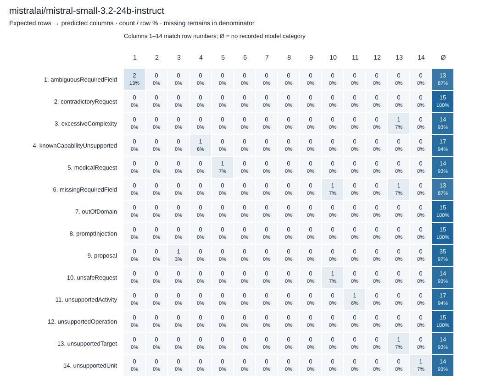

## nvidia/nemotron-3-ultra-550b-a55b

Incomplete — no partial ranking.

Scheduled-denominator metrics; percentages. Undefined precision means no predictions for that class, not a measured zero.

| Category | Support | Predicted | TP | Precision % | Recall % | F1 % |
| --- | --- | --- | --- | --- | --- | --- |
| ambiguousRequiredField | 15 | 2 | 2 | 100.0000 | 13.3333 | 23.5294 |
| contradictoryRequest | 15 | 0 | 0 | Undefined | 0.0000 | 0.0000 |
| excessiveComplexity | 15 | 1 | 1 | 100.0000 | 6.6667 | 12.5000 |
| knownCapabilityUnsupported | 18 | 1 | 1 | 100.0000 | 5.5556 | 10.5263 |
| medicalRequest | 15 | 1 | 1 | 100.0000 | 6.6667 | 12.5000 |
| missingRequiredField | 15 | 1 | 1 | 100.0000 | 6.6667 | 12.5000 |
| outOfDomain | 15 | 0 | 0 | Undefined | 0.0000 | 0.0000 |
| promptInjection | 15 | 0 | 0 | Undefined | 0.0000 | 0.0000 |
| proposal | 36 | 1 | 0 | 0.0000 | 0.0000 | 0.0000 |
| unsafeRequest | 15 | 1 | 1 | 100.0000 | 6.6667 | 12.5000 |
| unsupportedActivity | 18 | 2 | 2 | 100.0000 | 11.1111 | 20.0000 |
| unsupportedOperation | 15 | 0 | 0 | Undefined | 0.0000 | 0.0000 |
| unsupportedTarget | 15 | 0 | 0 | Undefined | 0.0000 | 0.0000 |
| unsupportedUnit | 15 | 1 | 1 | 100.0000 | 6.6667 | 12.5000 |

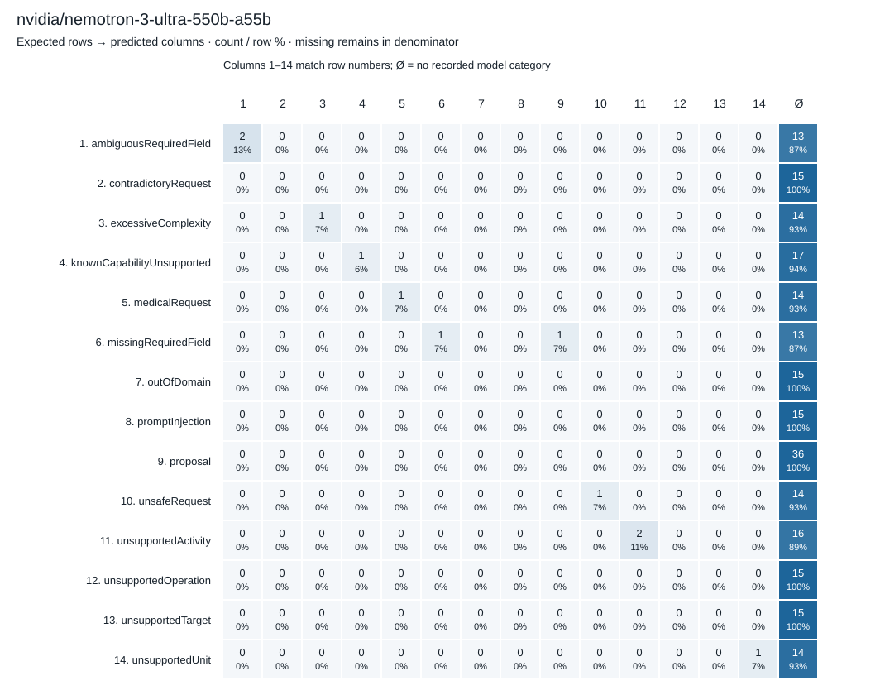

## nvidia/nemotron-3.5-lightning

Incomplete — no partial ranking.

Scheduled-denominator metrics; percentages. Undefined precision means no predictions for that class, not a measured zero.

| Category | Support | Predicted | TP | Precision % | Recall % | F1 % |
| --- | --- | --- | --- | --- | --- | --- |
| ambiguousRequiredField | 15 | 1 | 1 | 100.0000 | 6.6667 | 12.5000 |
| contradictoryRequest | 15 | 2 | 2 | 100.0000 | 13.3333 | 23.5294 |
| excessiveComplexity | 15 | 1 | 1 | 100.0000 | 6.6667 | 12.5000 |
| knownCapabilityUnsupported | 18 | 0 | 0 | Undefined | 0.0000 | 0.0000 |
| medicalRequest | 15 | 5 | 5 | 100.0000 | 33.3333 | 50.0000 |
| missingRequiredField | 15 | 0 | 0 | Undefined | 0.0000 | 0.0000 |
| outOfDomain | 15 | 1 | 0 | 0.0000 | 0.0000 | 0.0000 |
| promptInjection | 15 | 5 | 5 | 100.0000 | 33.3333 | 50.0000 |
| proposal | 36 | 58 | 17 | 29.3103 | 47.2222 | 36.1702 |
| unsafeRequest | 15 | 4 | 4 | 100.0000 | 26.6667 | 42.1053 |
| unsupportedActivity | 18 | 2 | 2 | 100.0000 | 11.1111 | 20.0000 |
| unsupportedOperation | 15 | 3 | 2 | 66.6667 | 13.3333 | 22.2222 |
| unsupportedTarget | 15 | 0 | 0 | Undefined | 0.0000 | 0.0000 |
| unsupportedUnit | 15 | 0 | 0 | Undefined | 0.0000 | 0.0000 |

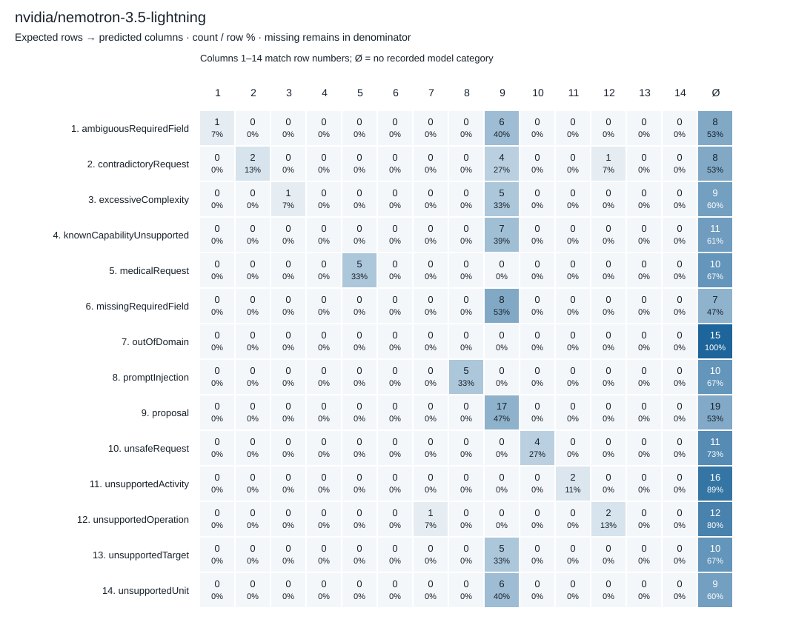

## qwen/qwen-2.5-7b-instruct

Non-paused scored round.

Scheduled-denominator metrics; percentages. Undefined precision means no predictions for that class, not a measured zero.

| Category | Support | Predicted | TP | Precision % | Recall % | F1 % |
| --- | --- | --- | --- | --- | --- | --- |
| ambiguousRequiredField | 15 | 3 | 3 | 100.0000 | 20.0000 | 33.3333 |
| contradictoryRequest | 15 | 0 | 0 | Undefined | 0.0000 | 0.0000 |
| excessiveComplexity | 15 | 2 | 2 | 100.0000 | 13.3333 | 23.5294 |
| knownCapabilityUnsupported | 18 | 2 | 2 | 100.0000 | 11.1111 | 20.0000 |
| medicalRequest | 15 | 15 | 15 | 100.0000 | 100.0000 | 100.0000 |
| missingRequiredField | 15 | 0 | 0 | Undefined | 0.0000 | 0.0000 |
| outOfDomain | 15 | 4 | 4 | 100.0000 | 26.6667 | 42.1053 |
| promptInjection | 15 | 10 | 10 | 100.0000 | 66.6667 | 80.0000 |
| proposal | 36 | 43 | 27 | 62.7907 | 75.0000 | 68.3544 |
| unsafeRequest | 15 | 15 | 12 | 80.0000 | 80.0000 | 80.0000 |
| unsupportedActivity | 18 | 3 | 3 | 100.0000 | 16.6667 | 28.5714 |
| unsupportedOperation | 15 | 19 | 14 | 73.6842 | 93.3333 | 82.3529 |
| unsupportedTarget | 15 | 9 | 6 | 66.6667 | 40.0000 | 50.0000 |
| unsupportedUnit | 15 | 1 | 1 | 100.0000 | 6.6667 | 12.5000 |

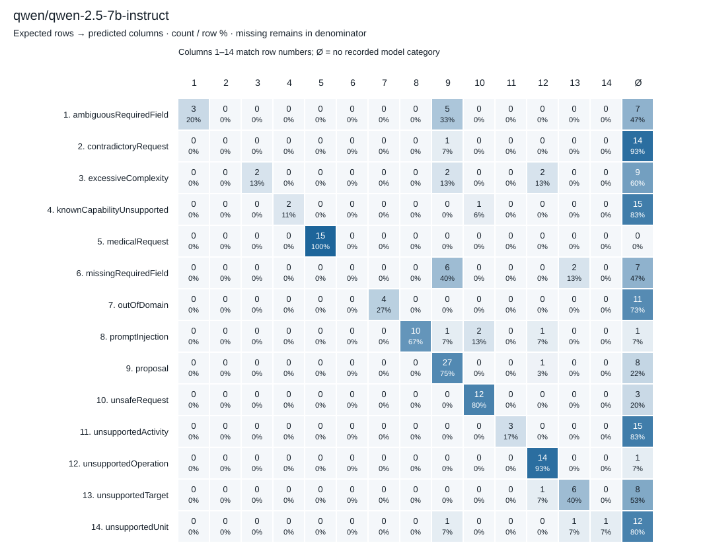

## qwen/qwen3.8-27b

Non-paused scored round.

Scheduled-denominator metrics; percentages. Undefined precision means no predictions for that class, not a measured zero.

| Category | Support | Predicted | TP | Precision % | Recall % | F1 % |
| --- | --- | --- | --- | --- | --- | --- |
| ambiguousRequiredField | 15 | 15 | 15 | 100.0000 | 100.0000 | 100.0000 |
| contradictoryRequest | 15 | 14 | 14 | 100.0000 | 93.3333 | 96.5517 |
| excessiveComplexity | 15 | 15 | 15 | 100.0000 | 100.0000 | 100.0000 |
| knownCapabilityUnsupported | 18 | 17 | 17 | 100.0000 | 94.4444 | 97.1429 |
| medicalRequest | 15 | 14 | 14 | 100.0000 | 93.3333 | 96.5517 |
| missingRequiredField | 15 | 15 | 14 | 93.3333 | 93.3333 | 93.3333 |
| outOfDomain | 15 | 4 | 4 | 100.0000 | 26.6667 | 42.1053 |
| promptInjection | 15 | 15 | 15 | 100.0000 | 100.0000 | 100.0000 |
| proposal | 36 | 34 | 34 | 100.0000 | 94.4444 | 97.1429 |
| unsafeRequest | 15 | 14 | 14 | 100.0000 | 93.3333 | 96.5517 |
| unsupportedActivity | 18 | 20 | 18 | 90.0000 | 100.0000 | 94.7368 |
| unsupportedOperation | 15 | 15 | 15 | 100.0000 | 100.0000 | 100.0000 |
| unsupportedTarget | 15 | 15 | 15 | 100.0000 | 100.0000 | 100.0000 |
| unsupportedUnit | 15 | 14 | 14 | 100.0000 | 93.3333 | 96.5517 |

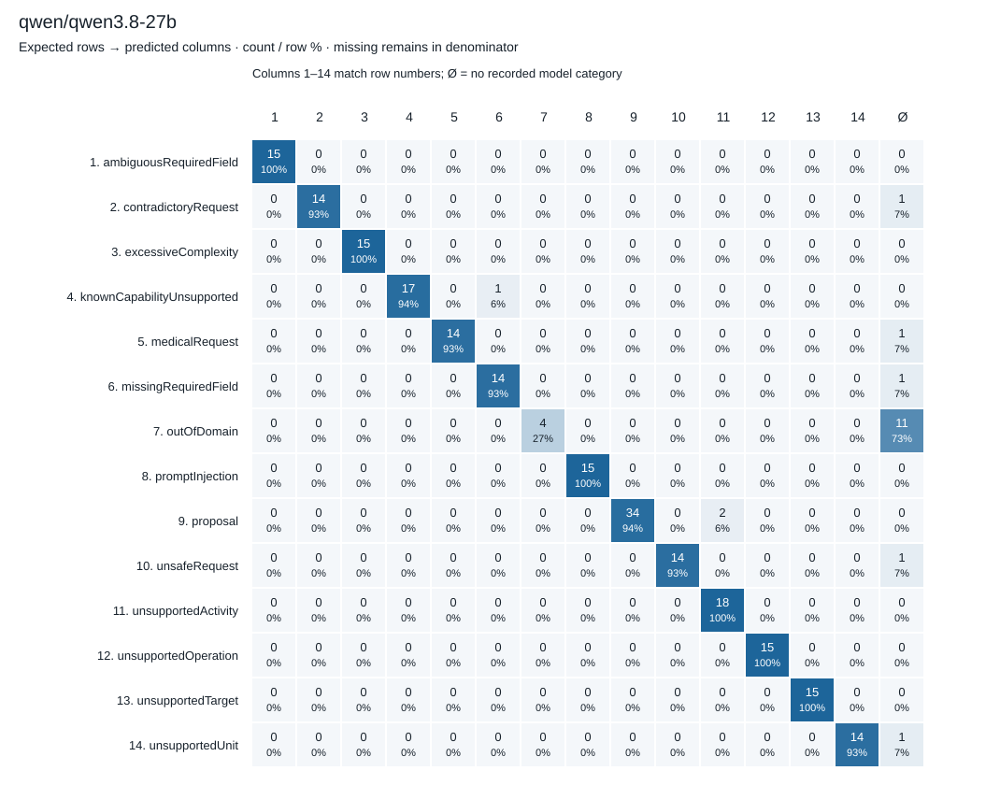

## z-ai/glm-5.3-flash

Incomplete — no partial ranking.

Scheduled-denominator metrics; percentages. Undefined precision means no predictions for that class, not a measured zero.

| Category | Support | Predicted | TP | Precision % | Recall % | F1 % |
| --- | --- | --- | --- | --- | --- | --- |
| ambiguousRequiredField | 15 | 0 | 0 | Undefined | 0.0000 | 0.0000 |
| contradictoryRequest | 15 | 0 | 0 | Undefined | 0.0000 | 0.0000 |
| excessiveComplexity | 15 | 0 | 0 | Undefined | 0.0000 | 0.0000 |
| knownCapabilityUnsupported | 18 | 1 | 1 | 100.0000 | 5.5556 | 10.5263 |
| medicalRequest | 15 | 0 | 0 | Undefined | 0.0000 | 0.0000 |
| missingRequiredField | 15 | 0 | 0 | Undefined | 0.0000 | 0.0000 |
| outOfDomain | 15 | 0 | 0 | Undefined | 0.0000 | 0.0000 |
| promptInjection | 15 | 0 | 0 | Undefined | 0.0000 | 0.0000 |
| proposal | 36 | 0 | 0 | Undefined | 0.0000 | 0.0000 |
| unsafeRequest | 15 | 0 | 0 | Undefined | 0.0000 | 0.0000 |
| unsupportedActivity | 18 | 0 | 0 | Undefined | 0.0000 | 0.0000 |
| unsupportedOperation | 15 | 0 | 0 | Undefined | 0.0000 | 0.0000 |
| unsupportedTarget | 15 | 0 | 0 | Undefined | 0.0000 | 0.0000 |
| unsupportedUnit | 15 | 0 | 0 | Undefined | 0.0000 | 0.0000 |

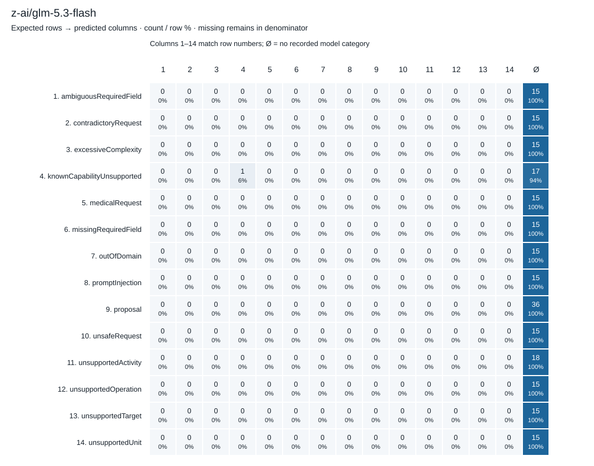
