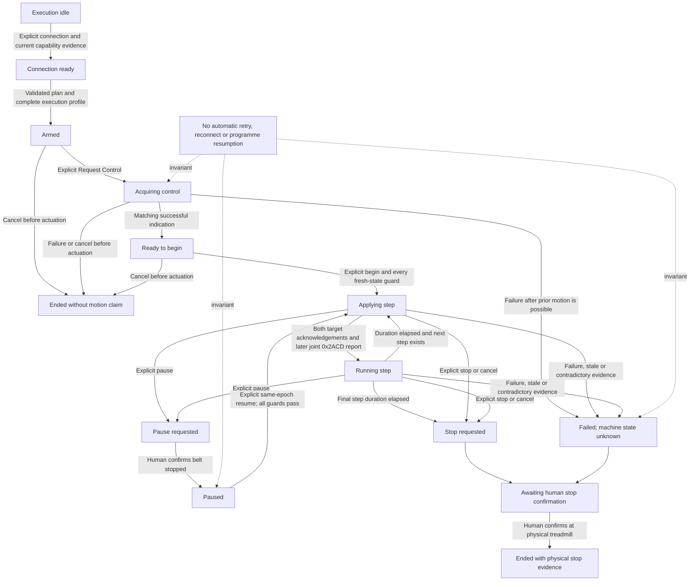
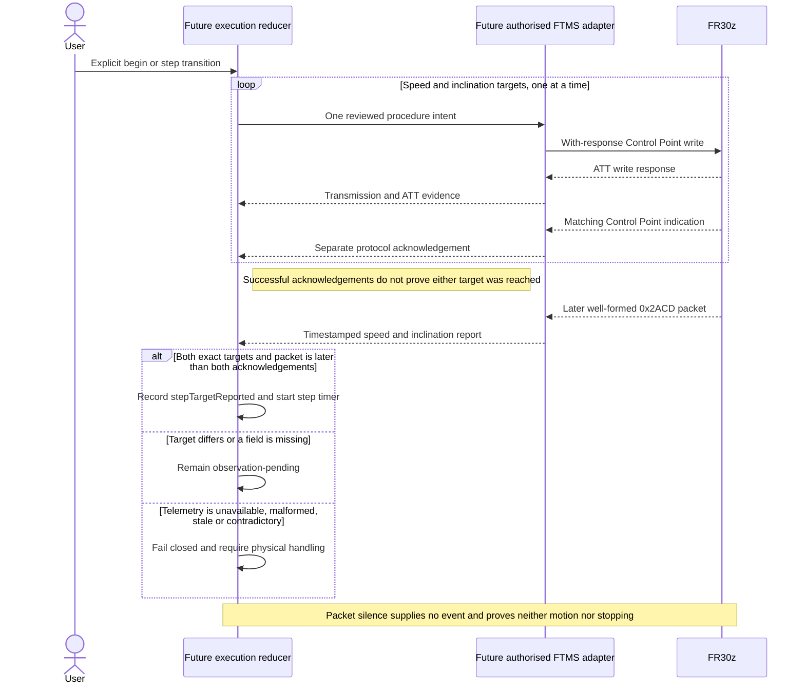

# Safety-gated workout execution state machine

Status: documentation-only design for GitHub issue [#4](https://github.com/syamaner/paceprompt-ios/issues/4). This document does not authorise executable state-machine code, a Fitness Machine Control Point `0x2AD9` write, workout execution, automatic reconnection or physical treadmill operation.

## Scope and authority

This design defines how a future PacePrompt execution layer must reason about a locally validated workout, an FTMS connection, Control Point procedures, reported treadmill data and human observation. It is constrained by:

- the repository's current `AGENTS.md` safety rules;
- the accepted issue [#3](https://github.com/syamaner/paceprompt-ios/issues/3) workout-plan contract and its `WorkoutPlanValidator.ValidatedPlan` output;
- the issue [#2](https://github.com/syamaner/paceprompt-ios/issues/2) [safe FR30z Control Point handshake](fr30z-ftms-control-point-handshake.md); and
- the issue [#1](https://github.com/syamaner/paceprompt-ios/issues/1) passive FR30z evidence recorded in the handshake and repository README.

The protocol facts come from Fitness Machine Service 1.0.1 and Fitness Machine Profile 1.0.1 as checked for the issue #2 specification on 3 September 2026. The earlier product concept remains eventual-product context only.

This document specifies a deterministic product policy, not evidence that the FR30z implements it. Current evidence does not establish Request Control, target, Start or Resume, Stop or Pause behaviour. It also does not establish a safe target-command order, target-observation deadline, telemetry-freshness window or reliable non-human stop signal. Until separate, reviewed evidence supplies every required execution-profile value, the `beginWorkout` guard defined below is false.

## Evidence remains separate

The future implementation must store these as distinct, timestamped facts. No item implies a later item.

| Evidence | Establishes | Does not establish |
| --- | --- | --- |
| Capability snapshot | The current connection returned well-formed `0x2ACC`, `0x2AD4` and `0x2AD5` values that validate the plan. | That a procedure is accepted or that the machine acts. |
| Command intent | The reducer authorised one exact procedure effect. | That bytes were transmitted. |
| Command transmission | One with-response write was submitted with the intended bytes. | ATT acceptance, protocol success or machine state. |
| ATT write response | The server accepted the write at the ATT layer and the FTMS procedure began. | FTMS procedure success or machine state. |
| Protocol acknowledgement | One well-formed, correlated Control Point indication returned `Success`. | That a target was reached, persisted, or was mechanically achieved. |
| Reported telemetry | A later well-formed `0x2ACD` packet explicitly reported the included values at receipt. | State between or after packets, physical calibration, motion or stopping during silence. |
| Human observation | The operator directly observed the physical treadmill and retained authority over the console and safety key. | Protocol acknowledgement or permission for automation. |

`0x2AD3` Training Status and `0x2ADA` Fitness Machine Status are timestamped advisory evidence only. A well-formed explicit safety or control-loss event may make the state less permissive, but missing notifications can never establish or preserve connection, control, motion, pause, stop or target state. The state machine does not require either notification path to progress.

## Deterministic model

The complete state is a product of independent dimensions rather than one overloaded “connected/running” value. Every accepted event carries a monotonic receipt time and the current `connectionEpoch`; procedure events also carry the locally generated `procedureID`, opcode and exact request bytes.

### Connection state

| State | Meaning |
| --- | --- |
| `disconnected` | No current link. No control permission or current telemetry exists. |
| `connecting(epoch)` | An explicit user action initiated this connection attempt. |
| `preparing(epoch)` | Connected while discovery, current capability reads and subscription outcomes are unresolved. |
| `ready(epoch, capabilitySnapshot)` | Required discovery and current capability reads are well formed; passive subscription outcomes and the `0x2AD9` indication subscription are resolved. |
| `lost(previousEpoch, reason)` | The link ended or Bluetooth became unavailable. Previous commands and telemetry are historical only. |

A new epoch is created only by a new user connection action. No event from an old epoch can mutate the current state. There is no reconnecting state.

### Control permission

| State | Meaning |
| --- | --- |
| `notHeld` | No successful Request Control is recorded for the current epoch. |
| `requesting(procedureID)` | The one in-flight procedure is Request Control. |
| `held(epoch, acknowledgement)` | Exactly one correlated Request Control procedure succeeded on this connection. This is protocol permission only. |
| `invalidated(reason)` | Permission is absent or cannot safely be relied upon. No target, start, resume, pause or stop procedure may be emitted. |

Disconnect, procedure timeout, correlation failure, malformed or unknown response, `Control Not Permitted`, explicit `0x2ADA FF`, capability change, app interruption, or a physical console/safety-key intervention invalidates control. Notification silence never proves that control is retained.

### Command-procedure state

| State | Meaning |
| --- | --- |
| `idle` | No Control Point procedure is in flight. |
| `transmissionPending(record)` | One exact with-response write effect was emitted; delivery is not yet known. |
| `indicationPending(record, writeAcceptedAt, deadline)` | ATT accepted the write. A single matching indication is due within the profile-mandated 30 seconds. |
| `acknowledged(record, indication)` | One exactly matching, well-formed indication returned `Success`. |
| `failed(record, reason)` | A definite negative, ATT error, malformed/mismatched/duplicate response or other known failure occurred. |
| `timedOutUnknown(record)` | No matching indication arrived within 30 seconds, or the link was lost with delivery unresolved. Machine effect is unknown. |

Only `idle` permits a new procedure. `acknowledged` and `failed` are evidence records that must be consumed by the execution reducer before the procedure state returns to `idle`. `timedOutUnknown` is not recoverable on the current link; a new procedure requires an explicit disconnect and user-initiated new connection.

### Telemetry state

Telemetry is evaluated per required `0x2ACD` field and for the combined speed/inclination target. Raw bytes, parse outcome, epoch and monotonic receipt time remain attached.

| State | Deterministic classification |
| --- | --- |
| `unavailable(reason)` | No well-formed value for the required field exists in the current epoch, the field is absent or encoded as unavailable, or the subscription/read path is unresolved or failed. |
| `fresh(sample)` | The latest packet is well formed, explicitly contains every required field and its age is no greater than the separately evidenced execution profile's freshness window. |
| `stale(lastSample)` | A previously well-formed sample has exceeded that window. It is retained only as history. Packet silence causes this transition; it supplies no new machine-state evidence. |
| `malformed(raw, error)` | A received packet cannot be decoded completely under the committed parser contract. No field from it is usable. |
| `contradictory(evidence)` | Current well-formed evidence conflicts with an active safety claim: for example, a post-confirmation packet reports either current-step target field at a different exact encoded value, a value lies outside the current capability snapshot, or direct human observation conflicts with the reported/app state. |

There is deliberately no default freshness duration. It must be supplied by a separately reviewed, FR30z-specific execution profile. Without it, telemetry cannot become `fresh` for execution. A non-matching sample during a target ramp remains fresh reported telemetry and leaves the target pending; it is not contradictory until the target has previously been jointly confirmed for the active step.

### Observed machine state

| State | Meaning |
| --- | --- |
| `unknown` | No current positive observation supports a narrower claim. This includes packet silence and every last-known value after staleness, disconnect or interruption. |
| `reported(speed, inclination, sample)` | One fresh, well-formed `0x2ACD` packet explicitly included both fields. This is an instantaneous report only. |
| `stepTargetReported(stepIndex, sample, acknowledgements)` | Speed and inclination each have a matching successful Control Point response, and one later packet than both responses explicitly reports both exact encoded step targets together. |
| `humanConfirmedStopped(observation)` | The operator directly confirms at the physical treadmill that the belt has stopped. Unless separately authorised physical evidence establishes another reliable signal, this is the only state that can complete a stop. |

Zero speed in one packet is `reported`, not `humanConfirmedStopped`. Packet silence, a last-known zero, protocol acknowledgement of Stop or Pause, and an app timer can never produce `humanConfirmedStopped`.

### Execution state

| State | Meaning |
| --- | --- |
| `idle` | No plan is armed. |
| `armed(plan, capabilitySnapshot, executionProfile)` | An immutable validated-plan snapshot is ready for explicit user review. No control request or motion command follows automatically. |
| `acquiringControl(context)` | The user explicitly requested control and the Request Control procedure is active. `context` is either initial acquisition or an explicitly requested same-epoch resume. |
| `readyToBegin` | Control is acknowledged for this epoch, but no potentially motion-causing procedure has been emitted. |
| `applyingStep(stepIndex, phase)` | The reducer is applying the execution profile's reviewed, deterministic command sequence one procedure at a time. `phase` records exact acknowledgements and observations. |
| `runningStep(stepIndex, activeElapsed, segmentStartedAt)` | Both targets are jointly confirmed by the required acknowledgements and later `0x2ACD` packet. Only now does the monotonic step-duration timer run. Pausing freezes accumulated active time. |
| `pauseRequested` | The user requested pause. No resume or next-step effect is allowed. |
| `awaitingHumanPauseConfirmation` | Any permitted Pause procedure outcome is recorded, but stationary state is not established. |
| `paused(observation)` | The human has confirmed the belt stopped. This is not permission to resume. |
| `stopRequested(reason)` | A final-step, explicit Stop, cancellation or failure has initiated the stop policy. |
| `awaitingHumanStop(reason, commandOutcome)` | A permitted Stop procedure may have succeeded, failed or remained unavailable/unknown; physical completion is still unconfirmed. |
| `ended(outcome, evidence)` | Terminal. `evidence` includes human stop confirmation whenever motion was possible or machine state became unknown. |
| `failedAwaitingHumanStop(reason)` | Terminal programme failure with physical state unresolved. The only accepted follow-up is human stop confirmation; it cannot resume. |

`motionPossible` is a monotonic safety latch alongside the execution state. It becomes true before emitting any speed, inclination, Start or Resume procedure, on a non-zero speed report, or on human observation of motion. It remains true across errors, silence, interruption and disconnect until a human stop confirmation is recorded. Control acquisition alone does not set it.

### Overall execution flow

This diagram is a visual index to the normative states and transition tables below. Every command-labelled edge is a future, separately authorised effect; the diagram does not authorise a write or physical operation.

## Execution profile gate

An execution profile is reviewed evidence scoped to an identified treadmill/firmware class. It is not inferred from characteristic presence or the product design. It must provide all of the following before `beginWorkout` can be enabled:

1. separately authorised physical evidence for Request Control and for every procedure the profile may emit;
2. exact allowed opcodes, encodings, successful responses and security prerequisites;
3. whether first-step actuation needs Start or Resume in addition to targets;
4. a deterministic speed/inclination command order, including transitions that increase or decrease either value;
5. an evidence-based target-observation deadline; expiry means “target not confirmed”, never “stopped”;
6. an evidence-based `0x2ACD` freshness window and the conditions under which a stream is considered interrupted;
7. separately evidenced Pause and Stop semantics, or an explicit policy that they are unavailable and the console/safety key must be used;
8. the human checks required before control acquisition, first actuation, pause, resume and stop; and
9. explicit equipment/firmware identity matching rules and invalidation conditions.

No tolerance may be invented. The issue #4 acceptance rule uses exact encoded targets. If later physical evidence justifies a tolerance, adopting it requires a separate design change and authorisation.

## Preconditions and guards

### Request Control

`requestControl` is accepted only when all of these are true:

- the user explicitly acts while the app is active and in the foreground;
- connection is `ready` in the current epoch and Bluetooth remains available;
- `0x2AD9` has Write and Indicate properties and its indication subscription is confirmed active;
- current `0x2ACC`, `0x2AD4` and `0x2AD5` values are well formed and internally consistent;
- passive `0x2ACD`, `0x2AD3` and `0x2ADA` subscription outcomes are resolved, without requiring either status characteristic to notify;
- the command-procedure state is `idle`, control is `notHeld`, and no failure requires a new link;
- the selected plan has produced `ValidatedPlan` against this exact capability snapshot;
- the Request Control procedure has separate implementation and physical-proof authorisation; and
- the operator has directly confirmed a clear deck, immediate access to the console and safety key, and the treadmill's physically stationary state.

The effect is one Request Control intent for a future authorised adapter. It is not a target or motion action. A matching protocol success moves execution to `readyToBegin`; no other response does.

### Begin workout

`beginWorkout` is accepted only when all of these are true at the event's monotonic time:

- execution is `readyToBegin`, connection is still `ready` in the same epoch, control is `held`, and the procedure state is `idle`;
- the immutable plan still validates against an unchanged current capability snapshot;
- a complete execution profile exists and matches the current equipment/firmware evidence;
- current `0x2ACD` telemetry is `fresh` and explicitly reports both speed and inclination;
- no telemetry, capability, protocol or human evidence is malformed, unavailable, stale or contradictory;
- the app remains foreground-active and no interruption has occurred since arming;
- the operator repeats the physical deck, console and safety-key check and explicitly confirms readiness; and
- the user performs a distinct begin action. Request Control success never starts a workout by itself.

If current FR30z behaviour supplies no fresh stationary `0x2ACD` packet, this guard remains false. Packet silence cannot be replaced by a last-known packet, `0x2AD3`, `0x2ADA` silence or an assumed zero.

## Events, transitions and effects

Effects below are declarative obligations for a future authorised implementation. “Emit procedure” never grants permission to implement or transmit it in this slice.

### Connection, preparation and control

| From | Event and guard | To | Effects and claims |
| --- | --- | --- | --- |
| any non-executing state with connection `disconnected/lost` | `userConnects(device)` | connection `connecting(newEpoch)` | Start only this explicit connection attempt. No automatic retry and no execution-state change. |
| connection `connecting/preparing` | discovery, reads and subscriptions complete and well formed | connection `ready` | Record capability and subscription evidence. No capability claim beyond decoded values. |
| execution `idle`, connection `ready` | `userArms(validatedPlan)` with the current capability snapshot and complete profile | execution `armed` | Freeze plan, capability and profile identities; emit no command. |
| `armed` | `userRequestsControl` and every Request Control guard passes | `acquiringControl` | Emit exactly one Request Control intent; procedure becomes `transmissionPending`. |
| `acquiringControl` | matching `80 00 01` after ATT acceptance | `readyToBegin` | Record protocol permission for this epoch only. No motion claim. |
| `acquiringControl` | any non-success, malformed, mismatch, timeout or disconnect | `failedAwaitingHumanStop` only if motion is possible; otherwise `ended(failedBeforeActuation)` | Invalidate control; send no compensating or retry procedure. Timeout requires a new link. |

### Applying and running a step

The execution profile returns one deterministic next action. Only one Control Point procedure may be active. For each step:

1. emit the next reviewed target or required Start/Resume procedure only while every begin/running guard remains true;
2. record command intent, transmission, ATT result and the exactly correlated FTMS response separately;
3. after each target's successful response, wait for observation; do not call it reached;
4. enter `runningStep` only after speed and inclination each have their matching successful response and one well-formed `0x2ACD` packet received later than both responses reports both exact encoded targets together; and
5. start that step's duration at the joint target report's monotonic receipt time, never at command submission or acknowledgement.

The acknowledgement and observation boundary is shown below. It is conceptual future behaviour, not an executable procedure or authority to transmit anything.

Each step requires its own target procedures and later joint packet, even when a target equals the preceding step's target. A prior step's acknowledgement or sample cannot be reused to claim that the new step reached its target.

| From | Event and guard | To | Effects and claims |
| --- | --- | --- | --- |
| `readyToBegin` | `userBegins` and all begin guards pass | `applyingStep(0, nextAction)` | Set `motionPossible`; emit only the first profile action. |
| `applyingStep` | matching successful response for current action | `applyingStep(updatedPhase)` | Record acknowledgement. For a target, await later telemetry; no reached claim. |
| `applyingStep` | later well-formed packet exactly matches one acknowledged target but not both current targets | `applyingStep(updatedPhase)` | Record instantaneous field evidence only. |
| `applyingStep` | one later well-formed packet than both target acknowledgements reports both exact targets | `runningStep(stepIndex, receiptTime)` | Record `stepTargetReported`; start monotonic step timer. |
| `applyingStep` | observation deadline expires, telemetry becomes stale/unavailable/malformed/contradictory, or any procedure fails | `failedAwaitingHumanStop` | Stop timers, invalidate control, emit no retry; direct the operator to console/safety key. |
| `runningStep` | fresh joint target reports continue and duration has not elapsed | same state | Update evidence only. `0x2AD3`/`0x2ADA` silence has no effect. |
| `runningStep` | telemetry becomes stale/unavailable/malformed/contradictory | `failedAwaitingHumanStop` | Stop timer and command progression; make machine state unknown; direct physical intervention. |
| `runningStep(i)` | duration elapses, a next step exists, and all guards remain true | `applyingStep(i + 1, nextAction)` | Stop old step timer; begin the next reviewed command sequence one procedure at a time. |
| final `runningStep` | duration elapses | `stopRequested(completedPlan)` | Do not mark workout complete; enter stop policy. |

A packet that differs from an unconfirmed target may show normal ramping and leaves observation pending. There is no step-timer progress before joint confirmation. A packet after confirmation that differs from either active target makes telemetry contradictory and fails closed.

### Pause, resume, stop and cancellation

Pause is never a timer-only condition. Stop is never complete from protocol or telemetry alone.

| From | Event and guard | To | Effects and claims |
| --- | --- | --- | --- |
| `applyingStep/runningStep` | `userPauses` | `pauseRequested` | Freeze all workout timers and suppress next-step effects immediately. If no procedure is in flight and the execution profile permits Pause, emit one Pause intent; otherwise tell the operator to use the console/safety key. |
| `pauseRequested` | the already in-flight procedure settles, or the permitted Pause procedure succeeds, fails, is unavailable or remains unknown | `awaitingHumanPauseConfirmation` | Preserve every exact command outcome. Do not send a second procedure or claim stationary state. |
| `awaitingHumanPauseConfirmation` | `humanConfirmsStopped` | `paused` | Record human observation. Invalidate execution assumptions and any control affected by physical intervention. |
| `paused` with control `invalidated/notHeld` | `userRequestsResume` and all Request Control guards pass in the unchanged epoch | `acquiringControl(resume)` | Never resume automatically. Emit only a new Request Control intent when the execution profile separately supports same-epoch reacquisition. |
| `paused` with control `held`, or `acquiringControl(resume)` after Request Control success | all fresh-resume guards pass | `applyingStep(currentStep, nextAction)` | Require foreground app, unchanged epoch/plan/capabilities/profile, fresh joint telemetry, explicit human readiness and a distinct user resume action. Reapply the current step through the profile. Preserve accumulated active duration; paused time is excluded. |
| any non-terminal execution state | `userStops` | `stopRequested(userStop)` | Freeze timers and suppress all non-stop effects. |
| any non-terminal execution state | `userCancels` while `motionPossible` is false and the current physical stationary confirmation remains valid | `ended(cancelledBeforeActuation)` | Invalidate control intent. No stop claim is made or needed. Any disconnect is a separate explicit user effect. |
| any state with `motionPossible` or unknown physical state | `userCancels` | `stopRequested(cancelled)` | Cancellation ends programme progression, not physical motion. Enter stop policy. |
| `stopRequested` | procedure idle and profile permits Stop | `awaitingHumanStop` | Emit at most one Stop intent. Record transmission and acknowledgement independently. |
| `stopRequested` | Stop unavailable, another procedure is in flight, connection is lost, or control is invalid | `awaitingHumanStop` | Emit no competing or guessed procedure. Direct immediate use of console/safety key. |
| `awaitingHumanStop/failedAwaitingHumanStop` | well-formed zero-speed packet, Stop success, packet silence or timer expiry | same state | Retain evidence, but do not complete stop. |
| `awaitingHumanStop/failedAwaitingHumanStop` | `humanConfirmsStopped` at the machine | `ended(outcome, humanStopEvidence)` | Stop is physically complete. Preserve whether the app Stop procedure succeeded, failed, was unavailable or was unknown as a separate outcome. |

If a Control Point procedure is already in flight when pause, stop or cancel is requested, no second procedure can be sent. Programme progression freezes and the operator is told to use the physical console or safety key immediately. A late response is recorded but cannot restart progression.

Disconnect, Bluetooth loss or app interruption while paused terminates that workout attempt after any required human stop confirmation. A connection in a new epoch can begin only a new workout attempt; it can never resume the paused one.

The fresh-resume guards are: the original epoch remains `ready`; the procedure state is `idle`; control is `held` or same-epoch reacquisition has just succeeded; the immutable plan, capability snapshot and execution profile are unchanged and still valid; current speed and inclination telemetry is `fresh`, well formed and non-contradictory; the saved active duration is less than the current step duration; the app is foreground-active; and the operator completes the profile's physical readiness check. Failure of any guard leaves the workout paused and emits no procedure.

### Retry policy

- There is no automatic retry of connection, Request Control, target, Start/Resume, Pause or Stop.
- No failed, timed-out, delivery-unknown, malformed, mismatched or negatively acknowledged procedure is retried within an execution.
- A target-observation timeout is not retried. The workout fails and requires physical stop confirmation.
- A later attempt is a new workout attempt after human-confirmed safe state, explicit disconnect where applicable, explicit user-created connection epoch, fresh reads/subscriptions, revalidation and a new user action.
- A Control Point timeout always requires a new link before any later procedure, as required by the issue #2 protocol contract.

## Failure and interruption handling

The first matching row wins, making the policy deterministic.

| Event | Required state change and effect |
| --- | --- |
| Bluetooth loss, powered-off state or transport failure | Set connection `lost`, control `invalidated`, procedure effect `timedOutUnknown` when delivery may have occurred, telemetry `unknown`, freeze timers, enter `failedAwaitingHumanStop` when motion is possible, and never reconnect. |
| App resigns active, enters background, terminates or loses execution continuity | Invalidate the execution and control assumptions, freeze timers, emit no background follow-on command, and require physical stop confirmation when motion is possible or unknown. On return, never resume or reconnect automatically. |
| Current capability read changes, becomes unavailable/malformed, or no longer validates the plan | Invalidate the capability snapshot, plan arming and control readiness; fail the workout. Do not revalidate in place or continue with narrowed/clamped targets. |
| Procedure ATT error, negative response, unknown result, malformed response, wrong opcode, duplicate response or correlation failure | Fail the procedure, invalidate control, suppress all further writes and require physical handling when motion is possible. |
| Procedure indication timeout | Mark delivery/machine effect unknown, invalidate control, require a new link for any later attempt and require physical handling when motion is possible. |
| Telemetry unavailable, stale or malformed during `applyingStep` or `runningStep` | Make observed state unknown, freeze progress, fail the workout and require physical handling. |
| Contradictory telemetry or human observation | Preserve all evidence, make observed state unknown, fail the workout and give the physical console/safety key immediate authority. |
| Explicit `0x2ADA FF`, safety-key status or user stop/pause status | Use it only to reduce permission or trigger fail-closed handling. Still require human confirmation for stop completion. |
| Missing `0x2AD3` or `0x2ADA` notification | No state-preserving or progress effect. Absence is not evidence. |

After any failure, late telemetry or indications may be logged against their original epoch/procedure but cannot return execution to a non-terminal state.

## Invariants

1. The physical console and safety key remain authoritative at all times.
2. A validated plan is necessary but never sufficient for execution.
3. A plan is executed only as the exact immutable `ValidatedPlan` snapshot reviewed by the user and revalidated against the current capability snapshot.
4. Characteristic discovery, feature bits and ranges never imply procedure support or machine action.
5. Connection, control permission, command procedure, telemetry, observed machine state and human observation remain independent state dimensions.
6. At most one Control Point procedure is in flight.
7. Every procedure is correlated by connection epoch, procedure ID, opcode, exact bytes and monotonic timestamps.
8. ATT success is not FTMS success; FTMS success is not target observation; target observation is not durable physical state.
9. Reaching a step target requires matching successful responses for its speed and inclination commands plus one later well-formed `0x2ACD` packet explicitly reporting both exact encoded targets.
10. Step duration starts only at that joint target observation and advances only while required telemetry remains fresh and non-contradictory.
11. No invented target tolerance, observation deadline, freshness window or command ordering is permitted.
12. Packet silence always moves evidence towards stale/unknown; it never proves motion, stopping, retained control or safety.
13. A last-known packet is historical after staleness, interruption or disconnect and cannot satisfy a guard.
14. `0x2AD3` and `0x2ADA` notifications are never required to establish or preserve progress. Explicit adverse events may only make state less permissive.
15. Stop completion requires human confirmation at the physical treadmill unless later, separately authorised physical evidence changes this invariant.
16. Pause, cancellation, failure and final-step expiry suppress normal progression immediately but do not themselves prove the belt stopped.
17. No automatic retry, reconnection, workout resumption or next command occurs.
18. Disconnect and app interruption invalidate control and current observation; a later user connection is a new session, never continuation.
19. Capability change invalidates the armed plan and active execution rather than causing in-place adaptation, clamping or rounding.
20. No failure path emits a compensating command unless that exact procedure and context have separately reviewed authority; the default effect is no write plus direction to the console/safety key.

## Future bounded slices

Each item requires its own user authorisation, review contract and evidence report. Ordering indicates dependency only and does not pre-authorise any item.

1. **Pure reducer contract:** executable state/event/effect types and exhaustive synthetic transition tests, with no CoreBluetooth dependency and no command adapter.
2. **Control Point codec and single-procedure transport:** pure request/response parsing plus one-in-flight correlation and timeout tests, still disconnected from workout execution.
3. **Request Control diagnostic proof:** the exact separately authorised, human-supervised `00` proof already bounded by the issue #2 document; no targets, motion, retry or programme.
4. **Passive freshness policy:** separately characterise FR30z `0x2ACD` delivery sufficiently to ratify a freshness window, field requirements and interruption behaviour; remain read-only.
5. **Individual target proofs:** separately authorise and characterise speed and inclination procedures, exact observation, ramping, safe values and failure handling. One target/proof at a time; no workout.
6. **Target-transition policy:** use accepted physical evidence to review deterministic speed/inclination ordering and target-observation deadlines across increases and decreases; documentation/pure tests first.
7. **Pause, Stop and Start/Resume characterisation:** separately authorise each required procedure and physical scenario, with the console and safety key authoritative and no automated programme.
8. **Synthetic workout orchestration:** connect the pure reducer to mocked procedure/telemetry effects and the accepted `ValidatedPlan`; no real Bluetooth writes.
9. **User safety and interruption UI:** implement explicit arming, human checks, cancellation, physical-stop confirmation and no-resume/no-reconnect presentation against synthetic effects.
10. **Narrow physical execution proof:** only after every prior blocker is resolved, separately authorise a supervised, minimal plan on identified equipment, with raw evidence and predetermined abort conditions.

No slice may combine hardware characterisation with general workout automation. Simulator or synthetic success cannot substitute for iPhone/FR30z evidence, and no physical proof may be inferred from this design.
