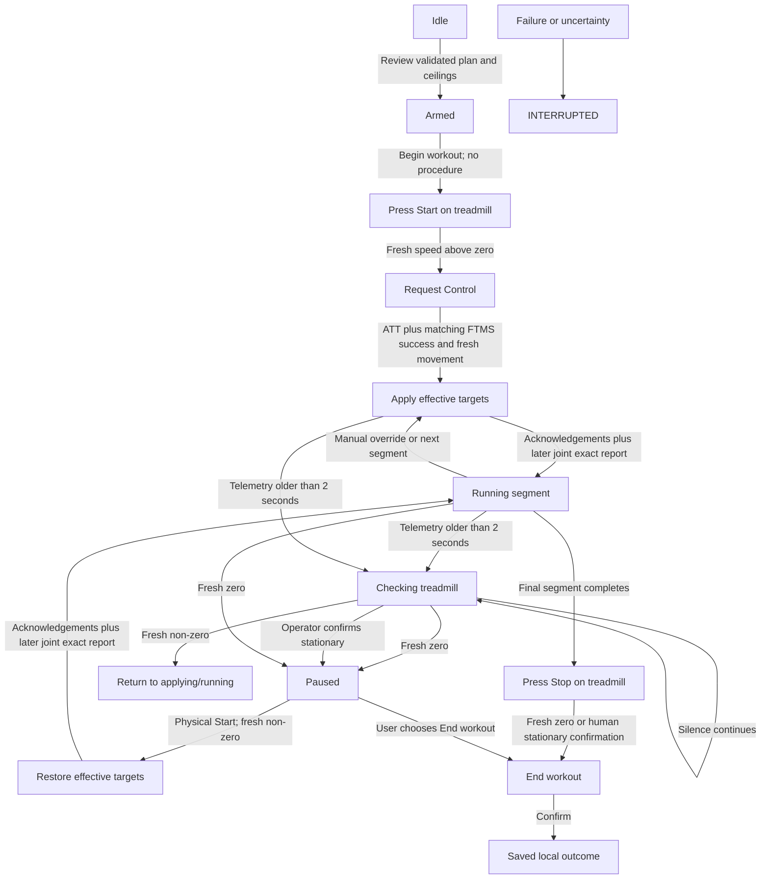

# Safety-gated workout execution state machine

Status: product design originally delivered by GitHub issue [#4](https://github.com/syamaner/paceprompt-ios/issues/4), revised by issue [#57](https://github.com/syamaner/paceprompt-ios/issues/57) for the accepted physical-console FR30z workflow and by issue [#131](https://github.com/syamaner/paceprompt-ios/issues/131) for same-process background continuity. The accepted executable #49 reducer remains a historical implementation snapshot; issue [#81](https://github.com/syamaner/paceprompt-ios/issues/81) owns its pure successor. Together with the accepted FR30z profile, this defines current production execution semantics rather than a future unauthorised capability. It does not by itself direct a physical treadmill session or permit behaviour beyond that profile.

## Current authority

This design is constrained by:

- the repository `AGENTS.md` safety and evidence boundaries;
- the immutable validated `WorkoutPlan` contract;
- the accepted issue #50 FTMS codec and one-procedure transport;
- the [FR30z physical-console execution profile](fr30z-physical-console-execution-profile.md); and
- the sanitised [11 September 2026 physical evidence](../docs/validation/fr30z-console-target-characterisation-2026-09-11.md).

The profile supersedes the old product assumptions that PacePrompt would send Start, Stop or Pause. The treadmill's physical console owns belt Start/Stop; PacePrompt owns Request Control, plan/manual speed and inclination targets, workout timing and the local End workout action.

## Invariants

1. The physical console and safety key remain authoritative.
2. Production never emits FTMS Start, Stop or Pause.
3. **Begin workout** starts an app attempt, not the belt.
4. Only fresh accepted non-zero `0x2ACD` evidence after waiting/paused permits initial or resume target application.
5. Only fresh accepted zero after prior motion, or a separate human stationary confirmation, establishes paused/ending eligibility. Silence and cached values never do.
6. At most one Control Point procedure is in flight.
7. Request Control, speed and inclination are the only permitted production procedures.
8. Intent, submission, ATT acceptance, FTMS acknowledgement, treadmill report and human observation remain separate.
9. A target is confirmed only by its required acknowledgement plus a later fresh joint exact speed/inclination report.
10. Planned, effective and actual targets remain separate. Current-segment manual overrides survive pause/resume and clear at the next segment.
11. A physical resume restores the last effective speed then inclination and resumes timing only after later joint target observation.
12. Failure, interruption or uncertainty emits no automatic retry, reconnect, control reacquisition or compensating command.
13. Simulator/software evidence is never physical FR30z evidence.
14. Inactive, background, screen lock and unlock are lifecycle context, not evidence that the connection or workout ended.
15. Elapsed progress comes only from current-epoch moving telemetry within the 2.0-second freshness window; timer delivery and elapsed wall time are never execution authority.
16. Background execution can submit only the one planned transition reached while processing a fresh current-epoch Treadmill Data notification. Interactive control remains foreground-only.

## Independent state dimensions

The reducer stores a product of independent state rather than one overloaded running flag. Every accepted event carries the current `connectionEpoch` and monotonic receipt time; procedure events also carry the local `procedureID`, opcode and exact bytes.

### Connection

| State | Meaning |
| --- | --- |
| `disconnected` | No current link, permission or telemetry. |
| `connecting(epoch)` | An explicit user action created a new connection epoch. |
| `preparing(epoch)` | Discovery, reads or required subscription outcomes remain unresolved. |
| `ready(epoch, capabilitySnapshot)` | Current required evidence is well formed and matches the profile. |
| `lost(previousEpoch, reason)` | The link ended; every previous value is historical. |

No automatic reconnect state exists. An event from an old epoch cannot mutate current state.

### Application lifecycle

| State | Meaning |
| --- | --- |
| `active` | Foreground reconciliation passed; interactive controls may additionally use their ordinary execution guards. |
| `inactive` | A transient presentation or protected-data transition. It preserves the same attempt and link but disables interactive actions. |
| `background` | The same process and link may consume CoreBluetooth events. Only a fresh Treadmill Data wake can authorise one due planned transition. |

Continuity additionally requires the same selected peripheral, live connection, connection epoch, held control permission, matched FR30z profile, resolved subscriptions and frozen session ceilings. A lifecycle transition does not manufacture any of those facts. Foreground return reconciles them, the pending procedure and telemetry freshness before controls become available.

### Control permission

| State | Meaning |
| --- | --- |
| `notHeld` | No Request Control success exists for the current epoch. |
| `requesting(procedureID)` | Request Control is the single in-flight procedure. |
| `held(epoch, acknowledgement)` | Matching FTMS success exists for this connection only. |
| `invalidated(reason)` | No target procedure may be emitted. |

Ordinary physical Stop/Start does not by itself invalidate control on the characterised profile. Explicit control loss, connection loss, procedure uncertainty/failure, app interruption, capability/profile change or contradiction does.

### Procedure

| State | Meaning |
| --- | --- |
| `idle` | A new permitted procedure may be considered. |
| `transmissionPending(record)` | One write effect was emitted; delivery is unknown. |
| `indicationPending(record, writeAcceptedAt, deadline)` | ATT accepted; matching FTMS indication is due within 30 seconds. |
| `acknowledged(record, indication)` | Matching response returned Success. |
| `failed(record, reason)` | A definite negative or invalid result occurred. |
| `timedOutUnknown(record)` | Delivery/effect is unresolved and the current execution cannot continue. |

Only `idle` permits another procedure. A terminal procedure record must be consumed by the reducer before returning to idle.

### Telemetry

| State | Meaning |
| --- | --- |
| `unavailable(reason)` | Required current-epoch speed/inclination evidence does not exist. |
| `fresh(sample)` | A well-formed `0x2ACD` packet includes both required fields and is no older than the profile's 2.0-second window. |
| `stale(lastSample)` | The sample exceeded 2.0 seconds. It is history, not current state. |
| `malformed(raw, error)` | The packet cannot be used. |
| `contradictory(evidence)` | Current machine/human evidence conflicts with the active execution claim. |

Advertised supported ranges constrain target-setting. A complete non-negative speed report below the advertised minimum target remains valid physical-start ramp evidence; it does not become a requested target. Negative speed or a report above the accepted maximum remains contradictory.

After movement has been observed or control is held, staleness freezes active time at the freshness boundary and enters `checkingTreadmill`. The reducer may count at most the 2.0-second freshness interval after the last accepted matching sample. A longer gap is excluded. Checking remains command-free while telemetry is absent. Fresh telemetry may resume accumulation from that sample, or the operator may separately confirm the treadmill stationary; silence alone never establishes stop and no longer terminates the attempt on a timer. Before control, `waitingForPhysicalStart` may remain unknown through stationary-report expiry or packet silence because it cannot emit a procedure until a fresh non-zero report arrives.

### Observed machine

| State | Meaning |
| --- | --- |
| `unknown` | No current positive evidence supports a narrower claim. |
| `reportedStationary(sample)` | A fresh packet reports 0.00 km/h. |
| `reportedMoving(sample)` | A fresh packet reports speed above zero. |
| `targetReported(stepIndex, sample, acknowledgements)` | A later fresh packet reports both exact effective targets after required acknowledgements. |
| `humanConfirmedStationary(observation)` | The operator directly confirms the treadmill is stationary. |

`reportedStationary` is enough for the product pause/End-workout gate, but it is not an emergency-stop guarantee. `humanConfirmedStationary` remains distinct.

### Effective targets

Each segment contains immutable planned speed/inclination targets and independent optional current-segment overrides:

`effective axis = manual override ?? planned axis`

Overrides survive pause/resume and clear on the next planned segment. An adjustment while waiting for physical Start, checking telemetry or paused changes pending state only. An adjustment during a procedure changes the pending effective target without creating a competing procedure.

### Execution

| State | Meaning |
| --- | --- |
| `idle` | No attempt exists. |
| `armed(plan, capabilities, ceilings, profile)` | Immutable reviewed inputs are ready. |
| `acquiringControl` | Request Control is in flight. |
| `waitingForPhysicalStart` | The app attempt is active and the UI instructs the operator to press physical Start. Before the first movement report, control is not held and no procedure has been sent. |
| `applyingTargets(step, phase)` | Speed then inclination procedures/observations are being applied. |
| `runningStep(step, activeElapsed, segmentStartedAt)` | Effective targets were acknowledged and later jointly observed; active time runs. |
| `checkingTreadmill(previousState, freshnessBoundary)` | Telemetry became stale; timers and plan progression are frozen. |
| `paused(step, activeElapsed, observation)` | Stationary evidence exists; current segment and effective targets are retained. |
| `restoringTargets(step, phase)` | Physical resume was observed; effective targets are being reapplied. |
| `awaitingPhysicalStopForCompletion` | Final segment ended; app progression is complete and the operator must physically Stop. |
| `readyToEnd(outcome, stationaryEvidence)` | End workout is available and sends no treadmill procedure. |
| `ended(outcome, evidence)` | Terminal local outcome. |
| `interrupted(reason, physicalState)` | Execution cannot continue; no further procedure is permitted. |

## Overall flow

## Guards and transitions

### Arm and Begin workout

Arming requires a validated immutable plan, exact current profile match, explicit session speed, inclination and maximum interval-change ceilings covering the complete plan, foreground activity, current connection readiness and no adverse evidence. A confirmed Treadmill Data subscription is required; a stationary packet is not.

Begin workout is accepted only from `armed`. It creates the local attempt, initialises the first segment and moves to `waitingForPhysicalStart` without emitting any procedure, motion or target effect.

The waiting UI shows the first segment targets and **Press Start on the treadmill**. A fresh zero keeps waiting, and its later expiry or a missing stationary report does not end this command-free pre-control wait. The first fresh non-zero report creates one Request Control effect. Matching ATT acceptance plus `80 00 01` permits initial target application while movement evidence remains fresh; otherwise another fresh non-zero report is required. Any Control Point failure ends before target actuation or interrupts if motion was separately observed.

### Target application and confirmation

The [profile](fr30z-physical-console-execution-profile.md) determines the next action:

1. emit Set Target Speed if speed must change or be restored;
2. wait for ATT acceptance and matching `80 02 01`;
3. emit Set Target Inclination if inclination must change or be restored;
4. wait for ATT acceptance and matching `80 03 01`;
5. wait for one later fresh `0x2ACD` packet reporting both exact effective targets;
6. start/resume segment timing at that final observation.

Only one axis is sent when only that axis changes. When neither changes, current fresh joint exact telemetry is required but no procedure is emitted.

A different fresh value before confirmation is ramp evidence and leaves the target pending. If no joint exact report arrives within 30.0 seconds after the final required acknowledgement, interrupt with target not confirmed. Do not retry or call it stopped.

### Planned transitions

The segment duration is evaluated only while processing accepted moving telemetry. Timer callbacks and a later foreground timestamp cannot finish a segment. When evidence-backed active duration finishes:

- freeze its active duration;
- if another segment exists, clear current-segment overrides and apply the next segment's planned targets;
- if it was final, enter `awaitingPhysicalStopForCompletion`, emit no treadmill Stop and instruct the operator to press physical Stop.

While backgrounded, the fresh telemetry callback that reaches one boundary may submit that one transition through the existing target-only path if every connection, epoch, permission, capability, subscription, ceiling, freshness and one-procedure guard still passes immediately before the write. An acknowledgement callback may settle the current axis but cannot submit the next axis while backgrounded; another fresh telemetry notification is required. Missed execution opportunities delay progress. Multiple missed steps and wall-clock catch-up sequences do not exist.

### Manual override

While the attempt is active, the user may increment/decrement speed or inclination inside current capability and selected session ceilings. Reject invalid values without rounding or clamping.

- From `runningStep`, update that axis's current-segment override and emit only the changed target procedure.
- Preserve the segment's accumulated active time; do not restart its duration.
- Resume active timing after the required acknowledgement and later joint exact observation.
- **Return to plan** removes overrides and uses the same procedure/observation rules.
- From `waitingForPhysicalStart`, `checkingTreadmill` or `paused`, update pending effective targets but emit nothing.
- While one target procedure is active, update pending effective targets, let the current procedure settle, then recompute the remaining sequence. Never cancel it or emit a competing write.

### Physical Stop, checking and pause

From `applyingTargets` or `runningStep`:

- a fresh zero enters `paused` immediately;
- telemetry age above 2.0 seconds freezes time at the freshness boundary and enters `checkingTreadmill`;
- fresh zero enters `paused`;
- a separate deliberate operator stationary confirmation enters `paused` without inventing telemetry;
- fresh non-zero and no adverse evidence returns to the preceding applying/running state, excluding the uncertain gap from active duration;
- continued silence remains `checkingTreadmill`, with active timing and plan progression frozen and no write emitted.

Packet silence does not establish pause. A separately deliberate operator stationary confirmation may establish `paused`/`readyToEnd` without inventing telemetry.

The UI tells the operator to wait for **Paused** before pressing physical Start again. If Stop/Start occurs before pause evidence, the app sees only a gap followed by movement and performs no restoration.

### Physical resume and restoration

From `paused`, a fresh current-epoch non-zero report means the treadmill reported physical resume. Resume restoration remains an interactive foreground-only path. If connection, control, profile, capability, foreground and procedure guards remain valid:

- preserve the same segment, accumulated active duration and overrides;
- enter `restoringTargets`;
- reapply effective speed then inclination sequentially;
- resume the timer only after matching acknowledgements and one later joint exact report.

Any failed guard leaves the workout interrupted and emits no target. No Request Control reacquisition or reconnect occurs automatically.

### End workout

End workout is a local lifecycle action, not a belt command.

- From `paused`, the user may select End workout.
- After the final segment, stationary telemetry or a human stationary confirmation enables End workout.
- The action finalises the local outcome and future history/Health workflow.
- It emits no FTMS Stop and never claims physical safety beyond its recorded evidence.

## Failure handling

The first matching rule wins:

| Event | State/effect |
| --- | --- |
| Bluetooth loss, powered-off state or transport failure | `interrupted`; connection/control/telemetry invalidated; no reconnect or write. |
| App resigns active, backgrounds, locks or unlocks | Preserve the same attempt and link; disable interactive actions; reconcile on foreground return. |
| Process termination, crash or device restart | Persisted `inProgress` attempt becomes interrupted on relaunch; no scan, reconnect, Request Control, target restoration, retry or resume. |
| Capability/profile/ceiling mismatch | Invalidate arming or interrupt active attempt; no in-place adaptation. |
| ATT error, negative/malformed/mismatched/duplicate response or correlation failure | Fail procedure, invalidate control, interrupt, no retry. |
| FTMS indication timeout | `timedOutUnknown`; require a new user-created attempt/link for later work. |
| Target-observation timeout | Target not confirmed; interrupt; no retry/compensation. |
| Telemetry stale or absent after 2 seconds | `checkingTreadmill`; freeze time/progression; no write; await fresh evidence or operator confirmation. |
| Contradictory telemetry or human observation | Preserve evidence, interrupt and return authority to console/safety key. |
| Explicit `0x2ADA` control loss | Invalidate control and interrupt. |
| Missing `0x2AD3` or `0x2ADA` notification | No permissive or state-preserving effect. |

Late evidence may be retained against its original epoch/procedure but cannot reopen an interrupted or ended attempt.

## Durable lifecycle checkpoint

Beginning an attempt, accepted execution changes and lifecycle changes write a bounded local checkpoint containing the history identity, selected peripheral/profile identity, connection epoch, phase, step, evidence-backed active duration, accepted overrides, effective and last-confirmed targets, and any pending procedure identity and intent. It contains no raw telemetry, diagnostics or credentials.

The checkpoint is crash-classification evidence only. A newly launched process may use it to mark the matching `inProgress` history record interrupted. It must not reconstruct an executable reducer state, opt into CoreBluetooth restoration, scan, reconnect, request control, retry, restore a target or resume a workout.

## Evidence projection

The UI and history projection must preserve:

- planned target;
- current effective target and override state;
- exact latest reported value and freshness;
- command intent/submission/ATT/FTMS state;
- target observation state;
- telemetry-based stationary/moving evidence;
- human stationary observation;
- active, paused, checking and uncertain duration.

No screen may shorten these into a stronger success or stop claim.

## Delivery sequence

The bounded delivery sequence is:

1. Completed: #81 — pure successor reducer with exhaustive synthetic tests.
2. Completed: #58 — Preflight and waiting-for-physical-Start UI using synthetic state.
3. Completed: #59 — synthetic orchestration, target overrides and incremental history.
4. Completed: #60 — portrait/landscape Exercise UI using synthetic orchestration.
5. Completed: #61 — production binding for Request Control, speed and inclination only.
6. Current product integration: #107 — saved-plan preparation, preflight and exercise flow without proof-only authorization or arming ceremony; physical behaviour still requires signed-iPhone observation.

No implementation slice inherits physical-session authority from this document.
